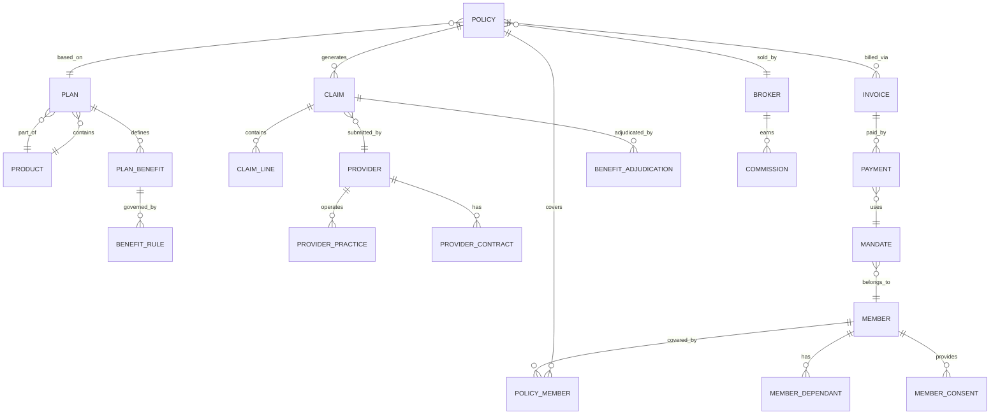
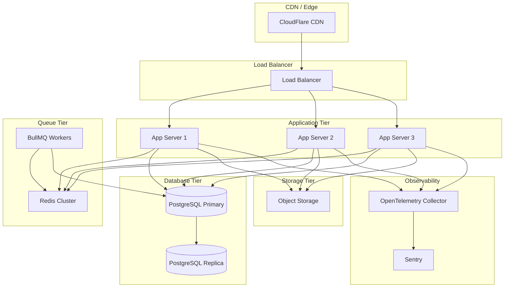

# Design Document: Day1Main Medical Insurer System

## Overview

Day1Main is a comprehensive medical insurer and health-financing operating system for South Africa. The system supports two regulated operating modes (Medical Scheme Administration under CMS, and Insurance under FSCA/PA) with compliance built into the architecture. The system handles the complete lifecycle: member management, products, providers, claims, payments, marketing, and governance.

### Technology Stack

- **Frontend**: Next.js 14+ (App Router), React 18+, TypeScript, Tailwind CSS, shadcn/ui components
- **Backend**: NestJS (Node.js/TypeScript microservices or modular monolith)
- **Database**: PostgreSQL 15+ (Supabase hosted or self-hosted)
- **Queue**: Redis + BullMQ for background jobs
- **Storage**: S3-compatible object storage (Supabase Storage or AWS S3)
- **Search**: PostgreSQL Full-Text Search or Meilisearch
- **Observability**: OpenTelemetry + Sentry
- **Payments**: PayFast / DebiCheck integration
- **Messaging**: SMTP2GO (email), WhatsApp Business API, SMS gateway
- **Authentication**: Supabase Auth or custom JWT-based auth

### Design Principles

1. **Compliance by Construction**: Regulatory requirements are enforced at the architecture level
2. **Audit Everything**: Immutable audit logs for all critical operations
3. **Separation of Duties**: Multi-step approval workflows prevent single-point-of-failure
4. **Data Protection**: POPIA compliance with encryption, access controls, and consent management
5. **Modularity**: Services are loosely coupled for maintainability and scalability
6. **Event-Driven**: Domain events drive workflows and maintain audit trails

## Architecture

### High-Level Architecture

```mermaid
graph TB
    subgraph "Frontend Layer"
        LP[Landing Page]
        MP[Member Portal]
        PP[Provider Portal]
        BP[Broker Portal]
        AB[Admin Backoffice]
        CC[Compliance Console]
        RS[Reporting Studio]
    end
    
    subgraph "API Gateway Layer"
        GW[API Gateway + Auth]
    end
    
    subgraph "Core Services"
        IAM[Identity & Access]
        MPA[Member & Policy Admin]
        PRE[Product & Rules Engine]
        PNM[Provider Network]
        CLA[Claims & PreAuth]
        PAY[Payments & Collections]
        FIN[Finance Ledger]
        BRK[Broker Management]
        CRM[Marketing & CRM]
        CMP[Complaints & Disputes]
        COM[Compliance & Risk]
        REP[Reporting]
    end
    
    subgraph "Infrastructure Services"
        DB[(PostgreSQL)]
        QUEUE[Redis/BullMQ]
        STORE[Object Storage]
        SEARCH[Search Engine]
        AUDIT[Audit Log Store]
    end
    
    subgraph "External Integrations"
        PAYG[Payment Gateway]
        BANK[Bank Statements]
        MSG[Email/SMS/WhatsApp]
        IDENT[Identity Verification]
        ESIGN[eSign Provider]
    end
    
    LP --> GW
    MP --> GW
    PP --> GW
    BP --> GW
    AB --> GW
    CC --> GW
    RS --> GW
    
    GW --> IAM
    GW --> MPA
    GW --> PRE
    GW --> PNM
    GW --> CLA
    GW --> PAY
    GW --> FIN
    GW --> BRK
    GW --> CRM
    GW --> CMP
    GW --> COM
    GW --> REP
    
    IAM --> DB
    MPA --> DB
    PRE --> DB
    PNM --> DB
    CLA --> DB
    PAY --> DB
    FIN --> DB
    BRK --> DB
    CRM --> DB
    CMP --> DB
    COM --> DB
    REP --> DB
    
    CLA --> QUEUE
    PAY --> QUEUE
    CRM --> QUEUE
    
    MPA --> STORE
    CLA --> STORE
    COM --> STORE
    
    CLA --> SEARCH
    MPA --> SEARCH
    
    IAM --> AUDIT
    CLA --> AUDIT
    PAY --> AUDIT
    PRE --> AUDIT
    
    PAY --> PAYG
    FIN --> BANK
    CRM --> MSG
    MPA --> IDENT
    COM --> ESIGN
```




### Service Boundaries

The system is organized into 12 core services with clear boundaries:

1. **Identity & Access (IAM)**: Authentication, authorization, RBAC, MFA, sessions, audit events
2. **Member & Policy Administration**: Member lifecycle, dependants, policies, endorsements, consents
3. **Product & Rules Engine**: Product catalog, benefit rules, pricing, underwriting, versioning
4. **Provider Network**: Provider registration, credentials, contracts, tariffs, networks
5. **Claims & Pre-Authorisation**: Claim intake, adjudication, preauth, PMB processing, appeals
6. **Payments & Collections**: Invoicing, contributions, mandates, payment processing, refunds
7. **Finance Ledger**: Double-entry accounting, GL, reconciliations, bank statement matching
8. **Broker Management**: Broker registration, commission calculation, statements
9. **Marketing & CRM**: Leads, campaigns, consent management, touchpoints, referrals
10. **Complaints & Disputes**: Case management, SLA tracking, escalations, Ombud exports
11. **Compliance & Risk**: POPIA workflows, breach management, fraud detection, vendor risk
12. **Reporting**: CMS/FSCA/PA/SARS reports, BI, data warehouse, ad-hoc queries


## Components and Interfaces

### 1. Identity & Access Management (IAM)

**Responsibilities:**
- User authentication (email/password, MFA, SSO)
- Session management with secure tokens
- Role-based access control (RBAC)
- Permission enforcement
- Audit logging for all access events

**Key Interfaces:**

```typescript
interface AuthService {
  login(credentials: LoginCredentials): Promise<AuthToken>
  logout(sessionId: string): Promise<void>
  refreshToken(refreshToken: string): Promise<AuthToken>
  setupMFA(userId: string, method: MFAMethod): Promise<MFASetup>
  verifyMFA(userId: string, code: string): Promise<boolean>
}

interface RBACService {
  assignRole(userId: string, roleId: string): Promise<void>
  revokeRole(userId: string, roleId: string): Promise<void>
  checkPermission(userId: string, permission: string): Promise<boolean>
  getUserRoles(userId: string): Promise<Role[]>
  getRolePermissions(roleId: string): Promise<Permission[]>
}

interface AuditService {
  logEvent(event: AuditEvent): Promise<void>
  queryAuditLog(filters: AuditFilters): Promise<AuditEvent[]>
}
```

**Database Tables:**
- users, profiles, roles, user_roles, permissions, role_permissions
- sessions, mfa_devices, audit_events (append-only)

### 2. Member & Policy Administration

**Responsibilities:**
- Member registration and KYC/CDD
- Dependant management
- Policy creation and lifecycle management
- Consent capture and management (POPIA)
- Member risk flagging
- Document storage

**Key Interfaces:**

```typescript
interface MemberService {
  registerMember(data: MemberRegistration): Promise<Member>
  updateMember(memberId: string, data: MemberUpdate): Promise<Member>
  addDependant(memberId: string, dependant: DependantData): Promise<Dependant>
  performKYC(memberId: string): Promise<KYCResult>
  flagRisk(memberId: string, flag: RiskFlag): Promise<void>
  captureConsent(memberId: string, consent: ConsentData): Promise<Consent>
  revokeConsent(consentId: string): Promise<void>
}

interface PolicyService {
  createPolicy(data: PolicyCreation): Promise<Policy>
  endorsePolicy(policyId: string, endorsement: Endorsement): Promise<Policy>
  lapsePolicy(policyId: string, reason: string): Promise<void>
  reinstatePolicy(policyId: string): Promise<Policy>
  addPolicyMember(policyId: string, memberId: string): Promise<void>
  removePolicyMember(policyId: string, memberId: string): Promise<void>
}
```

**Database Tables:**
- members, member_dependants, member_contacts, member_addresses
- member_employment, member_documents, member_consents
- member_risk_flags, member_status_history
- policies, policy_members, policy_status_history, endorsements

### 3. Product & Rules Engine

**Responsibilities:**
- Product catalog management
- Benefit rules definition and versioning
- Pricing tables
- Underwriting rules (insurance mode)
- Waiting period rules
- PMB rule packs (medical scheme mode)
- Rules simulation and testing
- Multi-step approval workflow

**Key Interfaces:**

```typescript
interface ProductService {
  createProduct(data: ProductData): Promise<Product>
  updateProduct(productId: string, data: ProductUpdate): Promise<Product>
  publishProduct(productId: string, approvals: Approval[]): Promise<void>
  archiveProduct(productId: string): Promise<void>
  getProduct(productId: string, version?: string): Promise<Product>
}

interface RulesEngine {
  evaluateBenefit(claim: Claim, policy: Policy): Promise<BenefitAdjudication>
  simulateClaim(claim: Claim, policy: Policy, ruleVersion: string): Promise<SimulationResult>
  checkWaitingPeriod(memberId: string, benefitCode: string): Promise<WaitingPeriodStatus>
  checkPMB(icd10Code: string, procedureCode: string): Promise<PMBStatus>
  applyRules(context: RuleContext): Promise<RuleResult>
}

interface ApprovalWorkflow {
  submitForApproval(entityId: string, entityType: string): Promise<ApprovalRequest>
  approve(approvalId: string, approverId: string): Promise<void>
  reject(approvalId: string, approverId: string, reason: string): Promise<void>
  getApprovalStatus(entityId: string): Promise<ApprovalStatus>
}
```

**Database Tables:**
- products, plans, plan_benefits, benefit_limits, benefit_exclusions
- benefit_rules, pricing_tables, underwriting_rules, waiting_period_rules
- pmb_provisions, pmb_icd10_map, dtp_rules, disclosures

### 4. Provider Network Management

**Responsibilities:**
- Provider registration and onboarding
- Credential verification
- Bank account verification
- Contract and tariff management
- Network assignment (DSP networks for schemes)
- Provider authorisations for claim submission

**Key Interfaces:**

```typescript
interface ProviderService {
  registerProvider(data: ProviderRegistration): Promise<Provider>
  verifyCredentials(providerId: string, credentials: Credential[]): Promise<VerificationResult>
  verifyBankAccount(providerId: string, bankDetails: BankDetails): Promise<VerificationResult>
  assignContract(providerId: string, contractId: string): Promise<void>
  assignNetwork(providerId: string, networkId: string): Promise<void>
  authorizeClaimSubmission(providerId: string): Promise<Authorization>
}

interface TariffService {
  createTariffSchedule(data: TariffScheduleData): Promise<TariffSchedule>
  getTariff(tariffCode: string, scheduleId: string): Promise<Tariff>
  updateTariff(tariffId: string, data: TariffUpdate): Promise<Tariff>
}
```

**Database Tables:**
- providers, provider_practices, provider_bank_accounts
- provider_credentials, provider_contracts, tariff_schedules
- provider_networks, provider_authorisations


### 5. Claims & Pre-Authorisation

**Responsibilities:**
- Claim intake from multiple channels (portal, EDI, API, call centre)
- Eligibility validation
- Code validation (ICD-10, procedure codes, tariffs)
- Rules adjudication via Rules Engine
- Fraud scoring and anomaly detection
- Pre-authorisation workflow
- Appeals and disputes
- PMB processing (medical scheme mode)

**Key Interfaces:**

```typescript
interface ClaimService {
  submitClaim(claim: ClaimSubmission): Promise<Claim>
  validateEligibility(memberId: string, serviceDate: Date): Promise<EligibilityResult>
  validateCodes(icd10: string[], procedures: string[]): Promise<CodeValidation>
  adjudicateClaim(claimId: string): Promise<BenefitAdjudication>
  approveClaim(claimId: string, assessorId: string): Promise<void>
  pendClaim(claimId: string, reason: string, documents: string[]): Promise<void>
  rejectClaim(claimId: string, reason: string): Promise<void>
  appealClaim(claimId: string, appeal: AppealData): Promise<Appeal>
}

interface PreAuthService {
  submitPreAuth(request: PreAuthRequest): Promise<PreAuth>
  reviewPreAuth(preAuthId: string, decision: PreAuthDecision): Promise<void>
  approvePreAuth(preAuthId: string, limits: Limits, conditions: string[]): Promise<void>
  linkClaimToPreAuth(claimId: string, preAuthId: string): Promise<void>
  checkPreAuthUtilisation(preAuthId: string): Promise<UtilisationStatus>
}

interface FraudDetection {
  scoreClaim(claim: Claim): Promise<FraudScore>
  detectAnomalies(claim: Claim): Promise<Anomaly[]>
  flagForInvestigation(claimId: string, reason: string): Promise<Investigation>
}
```

**Database Tables:**
- claims, claim_lines, claim_documents, claim_status_history
- preauth_requests, preauth_decisions
- clinical_codes, benefit_adjudications
- appeals, disputes, fraud_cases, recoveries

### 6. Payments & Collections

**Responsibilities:**
- Invoice generation
- Contribution tracking
- Payment mandate management (DebiCheck)
- Payment processing (debit orders, card payments)
- Payment gateway integration
- Retry logic for failed payments
- Grace periods and lapse management
- Refund processing
- Reconciliation preparation

**Key Interfaces:**

```typescript
interface BillingService {
  generateInvoice(policyId: string, period: BillingPeriod): Promise<Invoice>
  recordContribution(policyId: string, amount: Money): Promise<Contribution>
  calculateArrears(policyId: string): Promise<Money>
}

interface PaymentService {
  createMandate(memberId: string, bankDetails: BankDetails): Promise<Mandate>
  processPayment(invoiceId: string, method: PaymentMethod): Promise<Payment>
  handlePaymentCallback(callbackData: PaymentCallback): Promise<void>
  retryFailedPayment(paymentId: string): Promise<Payment>
  processRefund(refundRequest: RefundRequest): Promise<Refund>
}

interface CollectionsService {
  scheduleDebitOrder(mandateId: string, amount: Money, date: Date): Promise<ScheduledPayment>
  applyGracePeriod(policyId: string): Promise<void>
  lapseForNonPayment(policyId: string): Promise<void>
  sendArrearsNotice(memberId: string): Promise<void>
}
```

**Database Tables:**
- invoices, invoice_lines, contributions
- payment_methods, mandates, payments, refunds
- payment_failures, payment_retries

### 7. Finance Ledger & Reconciliation

**Responsibilities:**
- Double-entry general ledger
- Journal entry creation
- GL account management
- Bank statement import and matching
- Daily reconciliation
- Payment allocation
- Cost centre tracking

**Key Interfaces:**

```typescript
interface LedgerService {
  postJournal(journal: JournalEntry): Promise<void>
  getAccountBalance(accountId: string, date?: Date): Promise<Money>
  getTrialBalance(date: Date): Promise<TrialBalance>
  createGLAccount(account: GLAccountData): Promise<GLAccount>
}

interface ReconciliationService {
  importBankStatement(file: File): Promise<BankStatement>
  matchPayments(statementId: string): Promise<MatchResult[]>
  allocatePayment(paymentId: string, invoiceId: string): Promise<Allocation>
  reconcileDay(date: Date): Promise<ReconciliationReport>
  identifyDiscrepancies(date: Date): Promise<Discrepancy[]>
}
```

**Database Tables:**
- gl_accounts, gl_journals, gl_entries, cost_centres
- bank_statements, bank_statement_lines, allocations, reconciliations

### 8. Broker & Intermediary Management

**Responsibilities:**
- Broker registration and credentials
- Policy tracking by broker
- Commission calculation
- Commission statement generation
- Partner affiliate tracking

**Key Interfaces:**

```typescript
interface BrokerService {
  registerBroker(data: BrokerRegistration): Promise<Broker>
  trackPolicy(brokerId: string, policyId: string): Promise<void>
  calculateCommission(brokerId: string, period: Period): Promise<Commission>
  generateStatement(brokerId: string, period: Period): Promise<CommissionStatement>
}
```

**Database Tables:**
- brokers (subset of users), commissions, commission_statements

### 9. Marketing, CRM & Consent

**Responsibilities:**
- Lead capture and management
- Campaign management
- Consent-first marketing
- Message sending (email, SMS, WhatsApp)
- UTM attribution tracking
- Referral programme management
- Funnel tracking

**Key Interfaces:**

```typescript
interface LeadService {
  captureLead(lead: LeadData): Promise<Lead>
  assignLead(leadId: string, userId: string): Promise<void>
  convertLead(leadId: string, policyId: string): Promise<void>
  trackLeadSource(leadId: string, source: LeadSource): Promise<void>
}

interface CampaignService {
  createCampaign(campaign: CampaignData): Promise<Campaign>
  sendMessage(campaignId: string, recipients: string[], template: string): Promise<void>
  trackUTM(utmParams: UTMParams): Promise<void>
  generateReferralCode(memberId: string): Promise<ReferralCode>
}

interface ConsentService {
  checkMarketingConsent(memberId: string): Promise<boolean>
  optOut(memberId: string, channel: Channel): Promise<void>
  logMessage(messageId: string, status: MessageStatus): Promise<void>
}
```

**Database Tables:**
- leads, lead_sources, campaigns, touchpoints
- message_templates, message_sends, utm_attribution
- referrals, partner_affiliates


### 10. Complaints & Disputes

**Responsibilities:**
- Complaint case intake
- SLA timer management
- Escalation workflows
- Ombud export pack generation
- Root cause analysis and tagging

**Key Interfaces:**

```typescript
interface ComplaintService {
  createComplaint(complaint: ComplaintData): Promise<Complaint>
  assignComplaint(complaintId: string, agentId: string): Promise<void>
  escalateComplaint(complaintId: string, reason: string): Promise<void>
  resolveComplaint(complaintId: string, resolution: Resolution): Promise<void>
  generateOmbudPack(complaintId: string): Promise<OmbudExport>
  tagRootCause(complaintId: string, tags: string[]): Promise<void>
}
```

**Database Tables:**
- complaints, complaint_status_history, complaint_escalations

### 11. Compliance & Risk

**Responsibilities:**
- POPIA compliance workflows
- Data subject request processing
- Breach incident management
- Fraud detection and investigation
- Vendor risk assessment
- Compliance register maintenance
- Access log monitoring

**Key Interfaces:**

```typescript
interface POPIAService {
  submitDataSubjectRequest(request: DataSubjectRequest): Promise<DSRCase>
  processAccessRequest(caseId: string): Promise<DataExport>
  processErasureRequest(caseId: string): Promise<void>
  processRectificationRequest(caseId: string, corrections: Correction[]): Promise<void>
  recordBreach(breach: BreachIncident): Promise<BreachCase>
  notifyRegulator(breachId: string): Promise<void>
}

interface FraudService {
  detectDuplicateMember(memberData: MemberData): Promise<DuplicateMatch[]>
  detectClaimAnomaly(claim: Claim): Promise<AnomalyScore>
  detectProviderOutlier(providerId: string): Promise<OutlierReport>
  createInvestigation(entityId: string, reason: string): Promise<Investigation>
  generateSIUPack(investigationId: string): Promise<SIUExport>
}

interface ComplianceService {
  registerObligation(obligation: ComplianceObligation): Promise<void>
  scheduleReview(obligationId: string, date: Date): Promise<Review>
  assessVendor(vendorId: string): Promise<RiskAssessment>
  maintainRoPA(processing: ProcessingActivity): Promise<void>
}
```

**Database Tables:**
- compliance_register, compliance_reviews
- breach_incidents, data_subject_requests
- retention_policies, records_of_processing
- vendor_register, third_party_risk_assessments

### 12. Reporting & Analytics

**Responsibilities:**
- CMS regulatory reporting (medical scheme mode)
- FSCA/PA regulatory reporting (insurance mode)
- SARS third-party reporting
- Ad-hoc report generation
- BI dashboard data preparation
- Data warehouse ETL

**Key Interfaces:**

```typescript
interface ReportingService {
  generateCMSReport(reportType: CMSReportType, period: Period): Promise<Report>
  generateFSCAReport(reportType: FSCAReportType, period: Period): Promise<Report>
  generateSARSSubmission(taxYear: number): Promise<SARSFile>
  scheduleReport(reportId: string, schedule: Schedule): Promise<void>
  executeAdHocQuery(query: ReportQuery): Promise<ReportResult>
}

interface DataWarehouse {
  extractTransform(sourceTable: string, targetTable: string): Promise<void>
  refreshDashboard(dashboardId: string): Promise<void>
  exportData(filters: DataFilters, format: ExportFormat): Promise<File>
}
```

**Database Tables:**
- report_jobs, report_outputs
- sars_submissions, regulator_submissions

## Data Models

### Core Entity Relationships



### Key Data Structures

**Member**
```typescript
interface Member {
  id: string
  id_number: string // SA ID or passport
  first_name: string
  last_name: string
  date_of_birth: Date
  gender: Gender
  email: string
  phone: string
  kyc_status: KYCStatus
  risk_score: number
  pep_status: boolean
  created_at: Date
  updated_at: Date
}
```

**Policy**
```typescript
interface Policy {
  id: string
  policy_number: string
  plan_id: string
  regime: 'medical_scheme' | 'insurance'
  status: PolicyStatus
  start_date: Date
  end_date?: Date
  premium: Money
  billing_frequency: BillingFrequency
  broker_id?: string
  created_at: Date
  updated_at: Date
}
```

**Product & Plan**
```typescript
interface Product {
  id: string
  name: string
  regime: 'medical_scheme' | 'insurance'
  status: ProductStatus
  version: string
  effective_date: Date
  approval_status: ApprovalStatus
  created_by: string
  approved_by?: string[]
  created_at: Date
}

interface Plan {
  id: string
  product_id: string
  name: string
  description: string
  premium_base: Money
  waiting_period_days: number
  created_at: Date
}

interface PlanBenefit {
  id: string
  plan_id: string
  benefit_code: string
  benefit_name: string
  annual_limit?: Money
  per_event_limit?: Money
  co_payment_percentage?: number
  requires_preauth: boolean
  network_only: boolean
}
```

**Claim**
```typescript
interface Claim {
  id: string
  claim_number: string
  policy_id: string
  member_id: string
  provider_id: string
  service_date: Date
  submission_date: Date
  status: ClaimStatus
  total_claimed: Money
  total_approved: Money
  total_paid: Money
  preauth_id?: string
  created_at: Date
  updated_at: Date
}

interface ClaimLine {
  id: string
  claim_id: string
  icd10_code: string
  procedure_code: string
  tariff_code: string
  quantity: number
  amount_claimed: Money
  amount_approved: Money
  rejection_reason?: string
}
```


**Benefit Adjudication**
```typescript
interface BenefitAdjudication {
  id: string
  claim_line_id: string
  rule_version: string
  decision: AdjudicationDecision
  approved_amount: Money
  reason_codes: string[]
  audit_trail: RuleExecution[]
  pmb_applicable: boolean
  created_at: Date
}

interface RuleExecution {
  rule_id: string
  rule_name: string
  input: Record<string, any>
  output: Record<string, any>
  decision: string
  timestamp: Date
}
```

**Payment & Mandate**
```typescript
interface Payment {
  id: string
  payment_reference: string
  invoice_id: string
  mandate_id?: string
  amount: Money
  payment_method: PaymentMethod
  status: PaymentStatus
  gateway_reference?: string
  processed_at?: Date
  created_at: Date
}

interface Mandate {
  id: string
  member_id: string
  bank_name: string
  account_number: string
  account_type: AccountType
  debicheck_reference?: string
  status: MandateStatus
  created_at: Date
  expires_at?: Date
}
```

**Audit Event**
```typescript
interface AuditEvent {
  id: string
  event_type: string
  entity_type: string
  entity_id: string
  user_id: string
  action: string
  before_state?: Record<string, any>
  after_state?: Record<string, any>
  metadata: Record<string, any>
  ip_address: string
  user_agent: string
  timestamp: Date
}
```

## User Interface Design

### Layout Architecture

The UI follows a Supabase-inspired design with two distinct layouts:

#### 1. Public Landing Page Layout

```
┌─────────────────────────────────────────────────────┐
│  [Logo]              [Products] [About] [Login]     │
├─────────────────────────────────────────────────────┤
│                                                     │
│              Hero Section                           │
│         "Medical Coverage Made Simple"              │
│                                                     │
├─────────────────────────────────────────────────────┤
│                                                     │
│         Product Cards / Features                    │
│                                                     │
├─────────────────────────────────────────────────────┤
│                                                     │
│              Footer                                 │
│                                                     │
└─────────────────────────────────────────────────────┘
```

#### 2. Authenticated Application Layout (Supabase-style)

```
┌──────────┬──────────────────────────────────────────┐
│          │  [User Menu]                    [Search] │
│  [Logo]  ├──────────────────────────────────────────┤
│          │                                          │
├──────────┤                                          │
│          │                                          │
│  Nav     │         Main Content Area                │
│  Menu    │                                          │
│          │                                          │
│  • Home  │                                          │
│  • Dash  │                                          │
│  • Pol   │                                          │
│  • Clm   │                                          │
│  • Pay   │                                          │
│  • Docs  │                                          │
│          │                                          │
│          │                                          │
│          │                                          │
└──────────┴──────────────────────────────────────────┘
```

### Navigation Structure by Role

**Member Portal Navigation:**
```
- Dashboard (overview, quick actions)
- My Policy (details, documents, digital card)
- Claims (submit, track, history)
- Pre-Authorisations (submit, track)
- Payments (history, methods, invoices)
- Documents (policy docs, statements, tax certificates)
- Profile (personal info, dependants, consents)
- Support (help, complaints, contact)
```

**Provider Portal Navigation:**
```
- Dashboard (stats, pending items)
- Eligibility Check
- Submit Claim
- Submit Pre-Auth
- Claims History
- Payments (remittance advice, history)
- Tariffs (view applicable tariffs)
- Profile (practice info, bank details)
```

**Broker Portal Navigation:**
```
- Dashboard (pipeline, stats)
- Leads (capture, manage, convert)
- Quotes (generate, send)
- Policies (active, pending, lapsed)
- Commissions (statements, history)
- Reports
- Profile
```

**Admin Backoffice Navigation:**
```
- Dashboard
- Members
  - Search Members
  - Member Details
  - Onboarding Queue
- Policies
  - Active Policies
  - Endorsements
  - Lapses & Reinstatements
- Products & Rules
  - Product Catalog
  - Benefit Rules
  - Approval Queue
- Claims
  - Claims Workbench
  - Pending Claims
  - Appeals & Disputes
- Providers
  - Provider Directory
  - Onboarding Queue
  - Contracts & Tariffs
- Finance
  - Invoicing
  - Payments
  - Reconciliations
  - GL & Ledger
- Brokers
  - Broker Directory
  - Commissions
- Marketing
  - Leads
  - Campaigns
- Reports
```

**Compliance Console Navigation:**
```
- Dashboard (compliance status overview)
- POPIA
  - Data Subject Requests
  - Breach Register
  - Consent Management
  - Access Logs
- Fraud & Risk
  - Investigations
  - Risk Flags
  - Anomaly Reports
- Vendor Management
  - Vendor Register
  - Risk Assessments
- Compliance Register
  - Obligations
  - Reviews
  - RoPA
```

**Reporting Studio Navigation:**
```
- Dashboard
- Regulatory Reports
  - CMS Reports (if medical scheme)
  - FSCA/PA Reports (if insurance)
  - SARS Submissions
- Operational Reports
  - Claims Analytics
  - Financial Reports
  - Member Reports
- Ad-Hoc Queries
- Scheduled Reports
- Export History
```

### UI Component Library (shadcn/ui)

Key components to be used:

- **Navigation**: Sidebar, Breadcrumbs, Tabs
- **Forms**: Input, Select, Checkbox, Radio, DatePicker, FileUpload
- **Data Display**: Table, Card, Badge, Avatar, Tooltip
- **Feedback**: Alert, Toast, Dialog, Progress
- **Layout**: Container, Grid, Flex, Separator
- **Actions**: Button, DropdownMenu, ContextMenu

### Design System Tokens

```typescript
// Color Palette
const colors = {
  primary: {
    50: '#f0f9ff',
    500: '#0ea5e9',
    900: '#0c4a6e'
  },
  success: '#10b981',
  warning: '#f59e0b',
  error: '#ef4444',
  neutral: {
    50: '#fafafa',
    100: '#f5f5f5',
    900: '#171717'
  }
}

// Typography
const typography = {
  fontFamily: {
    sans: ['Inter', 'system-ui', 'sans-serif'],
    mono: ['JetBrains Mono', 'monospace']
  },
  fontSize: {
    xs: '0.75rem',
    sm: '0.875rem',
    base: '1rem',
    lg: '1.125rem',
    xl: '1.25rem',
    '2xl': '1.5rem',
    '3xl': '1.875rem'
  }
}

// Spacing
const spacing = {
  xs: '0.25rem',
  sm: '0.5rem',
  md: '1rem',
  lg: '1.5rem',
  xl: '2rem',
  '2xl': '3rem'
}
```

### Responsive Breakpoints

```typescript
const breakpoints = {
  sm: '640px',   // Mobile landscape
  md: '768px',   // Tablet
  lg: '1024px',  // Desktop
  xl: '1280px',  // Large desktop
  '2xl': '1536px' // Extra large
}
```


## Correctness Properties

A property is a characteristic or behavior that should hold true across all valid executions of a system—essentially, a formal statement about what the system should do. Properties serve as the bridge between human-readable specifications and machine-verifiable correctness guarantees.

The following properties define the correctness criteria for Day1Main. Each property is universally quantified and references the specific requirements it validates.

### Core System Properties

**Property 1: Product regime validation**
*For any* product creation or update attempt, the system should reject products without a valid regime tag ("medical_scheme" or "insurance") and accept products with valid regime tags.
**Validates: Requirements 1.2, 1.5**

**Property 2: Regime-specific compliance workflows**
*For any* product with a regime tag, the system should enforce the compliance workflows specific to that regime (Medical Schemes Act for "medical_scheme", Insurance Act for "insurance").
**Validates: Requirements 1.3, 1.4**

### POPIA and Data Protection Properties

**Property 3: Health data classification**
*For any* data field containing health information, the system should mark it with special personal information classification metadata.
**Validates: Requirements 2.1**

**Property 4: Consent-based processing**
*For any* health data processing operation, a corresponding consent record with the correct purpose must exist for that member.
**Validates: Requirements 2.2**

**Property 5: Least privilege access**
*For any* user attempting to access special personal information, the system should verify that the user has the minimum required permissions before granting access.
**Validates: Requirements 2.3**

**Property 6: Immutable audit trail for sensitive data**
*For any* access to special personal information, an audit event should be created that cannot be modified or deleted after creation.
**Validates: Requirements 2.4, 5.7, 5.8**

**Property 7: Data minimisation**
*For any* data collection form or API endpoint, only fields that are justified by the stated processing purpose should be requested or accepted.
**Validates: Requirements 2.6**

**Property 8: Data subject request processing**
*For any* data subject access request, the system should process it and mark it complete within the statutory timeframe (30 days in South Africa).
**Validates: Requirements 2.7, 25.1**

**Property 9: Separate consent capture**
*For any* member onboarding, the system should create two distinct consent records: one for data processing and one for marketing communications.
**Validates: Requirements 8.2, 21.1**

### FICA and KYC Properties

**Property 10: KYC execution**
*For any* member onboarding, the system should perform KYC checks and record the results with a risk score and PEP status.
**Validates: Requirements 3.2, 3.3, 3.4, 8.3**

**Property 11: FICA audit trail**
*For any* FICA-related activity (KYC check, PEP check, risk scoring), an audit event should be created with full details of the check performed.
**Validates: Requirements 3.6**

### Audit and Compliance Properties

**Property 12: Decision auditability**
*For any* critical decision (claim adjudication, benefit change, pricing change, member status change, refund, commission calculation), an immutable audit event should be created containing the decision, reasoning, and all relevant context.
**Validates: Requirements 5.1, 5.2, 5.3, 5.4, 5.5, 5.6**

**Property 13: Audit event immutability**
*For any* audit event, after creation, attempts to update or delete the event should fail.
**Validates: Requirements 5.7, 5.8**

**Property 14: SARS submission validation**
*For any* SARS submission file generation, the system should validate all data against SARS rules before generating the file, and reject invalid data.
**Validates: Requirements 4.3**

**Property 15: SARS submission audit trail**
*For any* SARS submission, an audit record should be created containing the file hash, submission date, and validation results.
**Validates: Requirements 4.4**

### Separation of Duties Properties

**Property 16: Multi-role product lifecycle**
*For any* product that is created, changed, approved, and published, the system should require that different users with different roles perform each step.
**Validates: Requirements 6.1**

**Property 17: Multi-step approval requirement**
*For any* product publication or benefit rule change, the system should require approval records from multiple roles (including Compliance Officer and Finance Manager) before allowing the change to take effect.
**Validates: Requirements 6.2, 6.3, 6.6, 6.7**

**Property 18: Role-based permission enforcement**
*For any* operation in the system, the system should verify that the user has the required permission for that operation before allowing it to proceed.
**Validates: Requirements 6.4**

**Property 19: Claims assessor restriction**
*For any* user with only the Claims Assessor role, attempts to create or modify benefit rules should fail.
**Validates: Requirements 6.5**

### Member Onboarding Properties

**Property 20: Required member data capture**
*For any* member onboarding, the system should capture and validate identity, contact, and address information before allowing the onboarding to proceed.
**Validates: Requirements 8.1**

**Property 21: Product eligibility validation**
*For any* product selection during member onboarding, the system should evaluate eligibility rules and reject ineligible selections.
**Validates: Requirements 8.4**

**Property 22: Regime-specific onboarding**
*For any* product selection, if the product regime is "insurance", underwriting should be performed; if "medical_scheme", rules eligibility should be validated.
**Validates: Requirements 8.5, 8.6**

**Property 23: Policy creation completeness**
*For any* completed member onboarding, the system should create a policy record, a payment mandate, and member portal credentials.
**Validates: Requirements 8.7, 8.8, 8.11**

**Property 24: Waiting period calculation**
*For any* policy creation, the system should calculate the cover activation date based on waiting period rules defined in the plan.
**Validates: Requirements 8.10**

### Claims Processing Properties

**Property 25: Multi-channel claim intake**
*For any* claim submission channel (member portal, provider portal, EDI, call centre), the system should accept and store claims with consistent data structure.
**Validates: Requirements 11.1**

**Property 26: Claim eligibility validation**
*For any* claim submission, the system should validate that the member has an active policy, waiting periods are satisfied, and the service is not excluded.
**Validates: Requirements 11.2, 11.3, 11.4**

**Property 27: Clinical code validation**
*For any* claim submission, the system should validate that ICD-10 codes, procedure codes, and tariff codes are valid according to the clinical codes table.
**Validates: Requirements 11.5**

**Property 28: Rules engine adjudication**
*For any* validated claim, the system should invoke the rules engine and produce a benefit adjudication result with decision reasoning.
**Validates: Requirements 11.6**

**Property 29: Fraud scoring execution**
*For any* adjudicated claim, the system should perform fraud scoring and anomaly detection, recording the results.
**Validates: Requirements 11.7**

**Property 30: Claim status assignment**
*For any* adjudicated claim, the system should assign a status of approved, pended, or rejected, along with appropriate reason codes.
**Validates: Requirements 11.8**

**Property 31: Pended claim document request**
*For any* claim with status "pended", the system should create a document request specifying the required additional information.
**Validates: Requirements 11.9**

**Property 32: Approved claim payment scheduling**
*For any* claim with status "approved", the system should create a payment record for either provider payment or member reimbursement.
**Validates: Requirements 11.10**

**Property 33: Paid claim statement generation**
*For any* claim with status "paid", the system should generate statement records for both the member and the provider.
**Validates: Requirements 11.11**

### PMB Properties (Medical Scheme Mode)

**Property 34: PMB claim protection**
*For any* claim in a medical scheme regime policy where the claim matches PMB criteria (ICD-10 code in PMB mapping and valid DTP), the system should not reject the claim and should apply minimum benefit coverage.
**Validates: Requirements 13.4, 13.5**

**Property 35: DTP logic application**
*For any* claim in a medical scheme regime policy, the system should evaluate Diagnosis-Treatment Pair logic to determine if PMB rules apply.
**Validates: Requirements 13.3**

### Payment and Collections Properties

**Property 36: Payment idempotency**
*For any* payment gateway callback, processing the same callback multiple times should result in only one payment record being created.
**Validates: Requirements 15.2**

**Property 37: Payment ledger entries**
*For any* payment processed, the system should create corresponding ledger entries, audit events, and member timeline entries.
**Validates: Requirements 15.3, 15.4, 15.5**

**Property 38: Failed payment retry**
*For any* failed payment, the system should schedule retries according to retry rules and track retry attempts.
**Validates: Requirements 14.2**

**Property 39: Grace period and lapse**
*For any* policy with repeated payment failures, the system should apply grace period rules and, if grace period expires without payment, lapse the policy.
**Validates: Requirements 14.3, 14.4, 14.5**

### Reconciliation Properties

**Property 40: Daily reconciliation execution**
*For any* business day, the system should perform reconciliation between expected payments and bank statement entries, identifying matches and discrepancies.
**Validates: Requirements 16.1, 16.4**

**Property 41: Payment allocation**
*For any* received payment, the system should automatically allocate it to the corresponding invoice based on payment reference matching.
**Validates: Requirements 16.2**

### Broker and Commission Properties

**Property 42: Commission calculation auditability**
*For any* commission calculation, the system should create an audit trail showing the calculation formula, inputs, and result.
**Validates: Requirements 17.3, 5.6**

**Property 43: Commission statement generation**
*For any* broker and billing period, the system should generate a commission statement showing all policies sold and commissions earned.
**Validates: Requirements 17.4**

### Complaints and Disputes Properties

**Property 44: SLA timer enforcement**
*For any* complaint created, the system should assign an SLA timer based on complaint type and trigger escalation if the timer expires without resolution.
**Validates: Requirements 18.2, 18.3**

**Property 45: Complaint resolution tracking**
*For any* complaint, the system should track the resolution outcome and allow root-cause tagging for analysis.
**Validates: Requirements 18.5**

### Product and Rules Engine Properties

**Property 46: Rules versioning**
*For any* benefit rule change, the system should create a new version with an effective date, preserving all previous versions.
**Validates: Requirements 19.1, 19.2**

**Property 47: Rules simulation**
*For any* rule version, the system should support simulation mode where test claims can be adjudicated without affecting production data.
**Validates: Requirements 19.3**

**Property 48: Rules audit output**
*For any* rule execution, the system should generate audit output explaining which rules were evaluated, their inputs, and their decisions.
**Validates: Requirements 19.4**

### Ledger Properties

**Property 49: Double-entry balance**
*For any* journal entry posted to the ledger, the sum of debit entries should equal the sum of credit entries.
**Validates: Requirements 20.2**

**Property 50: Account balance calculation**
*For any* GL account and date, the account balance should equal the sum of all journal entry amounts for that account up to that date.
**Validates: Requirements 20.2**

### Marketing and Consent Properties

**Property 51: Marketing consent check**
*For any* marketing message sent, the system should verify that the recipient has active marketing consent for the communication channel being used.
**Validates: Requirements 21.1, 21.2**

**Property 52: Opt-out processing**
*For any* opt-out request, the system should immediately update the member's marketing consent and prevent future marketing messages.
**Validates: Requirements 21.2**

**Property 53: Message logging**
*For any* message sent (email, SMS, WhatsApp), the system should log the message with recipient, content, timestamp, and delivery status.
**Validates: Requirements 21.3**

### Fraud Detection Properties

**Property 54: Duplicate member detection**
*For any* member registration, the system should check for existing members with matching bank account, phone number, or ID number, and flag potential duplicates.
**Validates: Requirements 22.1**

**Property 55: Claim anomaly detection**
*For any* claim, the system should calculate an anomaly score based on frequency, amount, and pattern analysis compared to historical data.
**Validates: Requirements 22.2**

**Property 56: Provider outlier detection**
*For any* provider, the system should analyze tariff usage and procedure code patterns to identify statistical outliers.
**Validates: Requirements 22.3**


## Error Handling

### Error Classification

Errors in Day1Main are classified into four categories:

1. **Validation Errors**: User input fails validation rules (e.g., invalid ID number, missing required field)
2. **Business Rule Errors**: Operation violates business rules (e.g., claim exceeds benefit limit, policy lapsed)
3. **System Errors**: Technical failures (e.g., database connection failure, external API timeout)
4. **Security Errors**: Authorization or authentication failures (e.g., insufficient permissions, invalid token)

### Error Response Format

All API errors follow a consistent format:

```typescript
interface ErrorResponse {
  error: {
    code: string              // Machine-readable error code
    message: string           // Human-readable error message
    details?: Record<string, any>  // Additional context
    timestamp: Date
    request_id: string        // For tracing
  }
}
```

### Error Handling Strategies

**Validation Errors:**
- Return 400 Bad Request with detailed field-level errors
- Log validation failures for monitoring
- Do not create audit events for validation failures

**Business Rule Errors:**
- Return 422 Unprocessable Entity with business rule explanation
- Create audit events for business rule violations
- Include rule reference in error details

**System Errors:**
- Return 500 Internal Server Error with generic message
- Log full error details to observability platform
- Create incident alerts for critical system errors
- Never expose internal system details to clients

**Security Errors:**
- Return 401 Unauthorized for authentication failures
- Return 403 Forbidden for authorization failures
- Create audit events for all security errors
- Implement rate limiting to prevent brute force attacks

### Retry and Idempotency

**Idempotent Operations:**
- All GET requests are naturally idempotent
- POST requests for payment processing use idempotency keys
- PUT and PATCH requests use optimistic locking (version numbers)

**Retry Strategy:**
- Failed payment processing: exponential backoff with max 5 retries
- External API calls: exponential backoff with circuit breaker
- Queue job processing: exponential backoff with dead letter queue

### Transaction Management

**Database Transactions:**
- Use database transactions for multi-table operations
- Keep transactions short to avoid lock contention
- Use optimistic locking for concurrent updates

**Distributed Transactions:**
- Use saga pattern for cross-service workflows
- Implement compensating transactions for rollback
- Store saga state in database for recovery

### Graceful Degradation

When external services are unavailable:
- Payment gateway down: queue payments for later processing
- Email service down: queue emails for later sending
- Identity verification down: allow manual verification workflow

## Testing Strategy

### Dual Testing Approach

Day1Main requires both unit testing and property-based testing for comprehensive coverage:

**Unit Tests:**
- Verify specific examples and edge cases
- Test integration points between components
- Test error conditions and boundary values
- Focus on concrete scenarios that demonstrate correct behavior

**Property-Based Tests:**
- Verify universal properties across all inputs
- Use randomized input generation to explore input space
- Catch edge cases that unit tests might miss
- Provide evidence that correctness properties hold

Both testing approaches are complementary and necessary. Unit tests catch specific bugs, while property tests verify general correctness.

### Property-Based Testing Configuration

**Framework Selection:**
- **TypeScript/JavaScript**: fast-check library
- **Python**: Hypothesis library
- **Java**: jqwik library

**Test Configuration:**
- Minimum 100 iterations per property test (due to randomization)
- Each property test must reference its design document property
- Tag format: `Feature: day1main-medical-insurer, Property {number}: {property_text}`

**Example Property Test Structure:**

```typescript
import fc from 'fast-check'

describe('Feature: day1main-medical-insurer, Property 1: Product regime validation', () => {
  it('should reject products without valid regime tag', () => {
    fc.assert(
      fc.property(
        fc.record({
          name: fc.string(),
          regime: fc.constantFrom(null, undefined, '', 'invalid')
        }),
        (productData) => {
          const result = productService.createProduct(productData)
          expect(result).toBeRejected()
        }
      ),
      { numRuns: 100 }
    )
  })

  it('should accept products with valid regime tag', () => {
    fc.assert(
      fc.property(
        fc.record({
          name: fc.string(),
          regime: fc.constantFrom('medical_scheme', 'insurance')
        }),
        (productData) => {
          const result = productService.createProduct(productData)
          expect(result).toBeAccepted()
        }
      ),
      { numRuns: 100 }
    )
  })
})
```

### Test Coverage Requirements

**Unit Test Coverage:**
- Minimum 80% code coverage for business logic
- 100% coverage for critical paths (claims adjudication, payment processing, audit logging)
- All error handling paths must be tested

**Property Test Coverage:**
- Each correctness property must have at least one property test
- Critical properties (audit, payment, PMB) should have multiple property tests
- Property tests should use smart generators that constrain to valid input space

### Integration Testing

**End-to-End Workflows:**
- Member onboarding → policy creation → first payment → claim submission → claim payment
- Employer onboarding → bulk member upload → monthly reconciliation
- Provider onboarding → claim submission → payment
- Product creation → approval workflow → publication
- Data subject request → data export → request completion

**External Integration Testing:**
- Payment gateway: use sandbox environment
- Email/SMS: use test accounts
- Bank statement import: use sample files
- Identity verification: use test API keys

### Performance Testing

**Load Testing:**
- Claims processing: 1000 claims per minute
- Payment processing: 500 payments per minute
- API endpoints: 100 requests per second per endpoint

**Stress Testing:**
- Database connection pool exhaustion
- Queue backlog handling
- Memory leak detection

### Security Testing

**Penetration Testing:**
- SQL injection attempts
- XSS attempts
- CSRF protection
- Authentication bypass attempts
- Authorization bypass attempts

**Compliance Testing:**
- POPIA compliance audit
- FICA compliance audit
- Audit log immutability verification
- Encryption verification

## Deployment Architecture

### Infrastructure Components



### Environment Strategy

**Development:**
- Local PostgreSQL database
- Local Redis instance
- Mock external services
- Seed data for testing

**Staging:**
- Mirrors production infrastructure
- Uses sandbox external services (payment gateway, SMS)
- Anonymized production data for testing
- Full observability stack

**Production:**
- Multi-AZ deployment for high availability
- Auto-scaling based on load
- Real external services
- Full backup and disaster recovery

### Database Migration Strategy

**Migration Tools:**
- Use Prisma Migrate or TypeORM migrations
- Version-controlled migration files
- Automated migration testing in CI/CD

**Migration Process:**
1. Write migration (up and down)
2. Test migration on development database
3. Test migration on staging database with production-like data
4. Schedule production migration during maintenance window
5. Execute migration with rollback plan ready
6. Verify data integrity post-migration

### Secrets Management

**Secret Storage:**
- Use environment variables for configuration
- Use secrets vault (AWS Secrets Manager, HashiCorp Vault) for sensitive data
- Rotate secrets regularly (every 90 days)

**Secret Types:**
- Database credentials
- API keys (payment gateway, SMS, email)
- Encryption keys
- JWT signing keys

### Monitoring and Alerting

**Metrics to Monitor:**
- API response times (p50, p95, p99)
- Error rates by endpoint
- Database query performance
- Queue depth and processing time
- Payment success/failure rates
- Claim processing times

**Alerts:**
- Critical: System down, database unavailable, payment gateway failure
- High: Error rate > 5%, API response time > 2s, queue depth > 1000
- Medium: Disk space > 80%, memory usage > 85%
- Low: Certificate expiring in 30 days

### Backup and Recovery

**Backup Strategy:**
- Database: Continuous backup with point-in-time recovery
- Object storage: Versioning enabled with lifecycle policies
- Backup retention: 30 days for daily backups, 1 year for monthly backups

**Recovery Procedures:**
- RTO (Recovery Time Objective): 4 hours
- RPO (Recovery Point Objective): 15 minutes
- Regular disaster recovery drills (quarterly)

## Implementation Phases

Given the massive scope of Day1Main, implementation should be phased:

### Phase 1: Foundation (Weeks 1-4)
- Database schema and migrations
- Authentication and RBAC
- Audit logging infrastructure
- Basic member registration
- Basic product catalog

### Phase 2: Core Workflows (Weeks 5-10)
- Member onboarding (individual)
- Policy creation and management
- Provider onboarding
- Basic claims submission and validation
- Payment mandate creation

### Phase 3: Claims Processing (Weeks 11-16)
- Rules engine implementation
- Claims adjudication
- PMB processing (medical scheme mode)
- Pre-authorisation workflow
- Fraud detection basics

### Phase 4: Financial (Weeks 17-22)
- Payment processing and gateway integration
- Collections and retry logic
- Double-entry ledger
- Reconciliation engine
- Broker commission calculation

### Phase 5: Compliance (Weeks 23-28)
- POPIA workflows (data subject requests, breach management)
- FICA/KYC integration
- Complaints and disputes
- Regulatory reporting (CMS, FSCA/PA, SARS)

### Phase 6: Portals and UI (Weeks 29-36)
- Member portal
- Provider portal
- Broker portal
- Admin backoffice
- Compliance console
- Reporting studio

### Phase 7: Advanced Features (Weeks 37-42)
- Employer/group onboarding
- Marketing and CRM
- Advanced fraud detection
- Data warehouse and BI
- Performance optimization

### Phase 8: Testing and Hardening (Weeks 43-48)
- Comprehensive property-based testing
- Security testing and penetration testing
- Load and performance testing
- Compliance audits
- User acceptance testing

## Conclusion

Day1Main is a comprehensive medical insurer operating system designed for the South African market with compliance built into the architecture. The system supports dual operating modes (Medical Scheme and Insurance), implements POPIA/FICA/SARS compliance, and provides complete lifecycle management for members, policies, claims, and payments.

The design emphasizes:
- **Compliance by construction**: Regulatory requirements enforced at the architecture level
- **Auditability**: Immutable audit logs for all critical operations
- **Separation of duties**: Multi-step approval workflows
- **Data protection**: POPIA compliance with encryption and access controls
- **Correctness**: Property-based testing to verify universal properties

Implementation will be phased over 48 weeks, with each phase building on the previous to deliver a production-ready system that meets all regulatory requirements and provides a solid foundation for growth.
